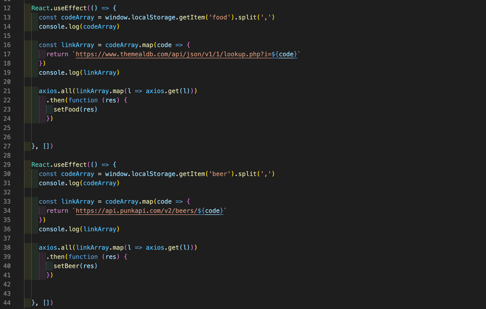

Project Two - My Night In:

Overview: Choose My Night In is a two day hackathon pair project that utilises Reacts responsive state changes to create a meal and beer randomizer with filter features. It uses local storage to create saved collections of combinations. It uses React framework with JavaScript, CSS and HTML.

Getting Started:

The project can be accessed and edited by forking the project to your own GitHub account and then following the steps to clone it to your device for development.

Or visit the deployed project here: [https://picturest-photography-app.netlify.app/](https://picturest-photography-app.netlify.app/) 

Brief:

This project was a two day hackathon done as part of a pair. The goal was to create a user-friendly React based app that could produce combinations of beer and dishes to remove the effort of deciding what they wanted to eat and drink on their night in. We were tasked to use Restful APIs to access the necessary data. After collecting the data we needed to use React states to create a responsive web app that uses user input to filter the choices. The end result of the user experience was a tab that could display the choices the user had made using an ‘add to choices button’.

The web app consists of an intro screen which provides instructions on how to use the program. After accessing the selection screen, the user is greeted by two ‘cards’ that contain a beer random selector and a meal random selector. They both contain an opportunity to specify either ABV or cuisine for the beer and meal selector respectively. Each card also has a button which redirects the user to an information page which gives details on the selected item, as well as a button that adds the beer or food to the collection page where they can view their choices. 

Technologies Used:

React.js

Node.js

Axios

HTML

CSS

APIs used:

theMealDB

PunkAPI

Process:

1. Planning/ decision making:

        Considering our pair programming and the remote nature of our partnership was the focal point of our planning and how we were to delegate the jobs between us. As our project used two APIs delivering a format of information that was almost identical, we saw it fit to define what the choice filtering options were and the activity of the randomization feature. Splitting the API requests and data formatting per API was our first course of action. We separately managed the data handling for each API.

2. Designing the API’s

        Following reading the API’s documentation, creating a component that made the required API calls in response to user input was the next step. I used JSX to return user input fields. The first being a cuisine selection drop down to filter the list, the following being a button the user could press to add the dish to the collection, finally there needed to be a randomize function to provide an option to the user. Each button had an event handler linked to specify the type of API request. 

        The cuisine choice changed the choice to select from dishes within the provided cuisine, by making an API call for the dishes within that cuisine. If there is no selection it makes an API call directly for a random dish.

        The add to collection button uses the window.localStorage entity to save the ids to their respective local storage arrays.

3. Combining the APIs 

        After we had finished our respective API instances, the next step was to introduce the two APIs as child components to the main page. This was done by importing the component functions. This also introduced the LINK and BrowserRouter elements to be able to redirect the user to different pages while also being used to transfer information between the pages.

4. More info pages/ collection

        After combining the main functionality of the app the next step was to create components for the ‘more information’ page and the ‘collection’ page. This was done by using the useParams function to ascertain which beer or meal was being viewed. The page will then use axios to request the meal or beer using the Id provided. The JSX formats the data and presents it in a legible manner. The collection page button updates when the user has made their decision and has confirmed it by clicking the prompt text. This state change allows the user to access the collection page where an Axios bulk Get request uses the local storage values.

5. Aesthetics

        Used CSS to represent the data coherently while also keeping consistency when viewed in different browser tab sizes and when different image sizes are displayed.

KnownErrors/Bugs:

Bug:

Currently the project runs best when running in Firefox as it is able to look-past certain bugs and inconsistencies when the two apis communicate with the main app. Unfortunately the app doesn't run well on Chrome due to its less forgiving nature.

Possible Fix:

Re-evaluating how the API’s act would be the best way to address the occurring bugs. Adding more conditions to the requests by adding simple analysis of the axios request responses would most likely lead to a more robust response to unexpected inputs. Which are most likely caused by certain values not being available when a certain combination of inputs are created.

Challenges:

One of the main challenges was to collate the choices made by the user into a separate page they could access after they had made their decisions. To be able to do this involved using props to pass the chosen dishes and beers through to another component. However due to how the APIs worked and the difficulty of simultaneously providing and saving the props without it displaying just one of the items proved to be a difficult challenge. My expertise with the new technology did not yet extend to passing props to parent or sibling components, as when I attempted to add these features, the results were inconsistent or did not work at all. After researching the options available, I decided to use the local storage feature as it provided a flexible and easy to access place to store dish and beer Ids. The ability to add to an array even allowed us to store multiple combinations, as well as being able to access the values even after the user had left the site. By storing the Ids of the API objects, I was able to use axios.all request to grab the objects information from the array of ids.

Wins:

Working efficiently as a pair allowed us to split the workload evenly when designing the ‘card’ instances of the beer and meal random generators. We ran into issues when incorporating both APIs as their requests worked in a slightly different manner. However we creatively used React hooks to combine them in a way that worked.

Future Improvements:

In regards to functionality the app works well within certain browsing environments however a more compatible version that is friendlier with Chrome would improve the user accessibility. As well as this the visual aesthetics of the site could be improved through further development within CSS. CSS animations and a more cohesive visual identity would create a complete package if it were to be used as a marketing campaign.

Key Learnings:

The most learning was done in regards to planning with the technologies used. The combination of APIs and React hooks was very dependent on how the states changed and planning when the hooks would update the data on the page. Greater emphasis on understanding the control flow would lead to a simpler app which would most likely solve the issues detailed above. 

A more robust understanding of the React environment was a significant learning experience as It allowed me to develop an informed way of addressing certain issues in later projects. An example in the form of the collection view button was especially difficult as the app required a state change to update the appearance of the button to proceed to the page. As a workaround we required the user to first click on the text which would create a state change depending on whether they had made enough choices to progress onto the next screen. Although the solution was robust, it was much to be desired in terms of visual coherence. In future, if the information was passed through a single page and only displayed in the cards, this would provide an easier way to reactively update the buttons accessibility by either showing a ‘greyed’ out button if the conditions are not met and a ‘colored’ button when they are.
